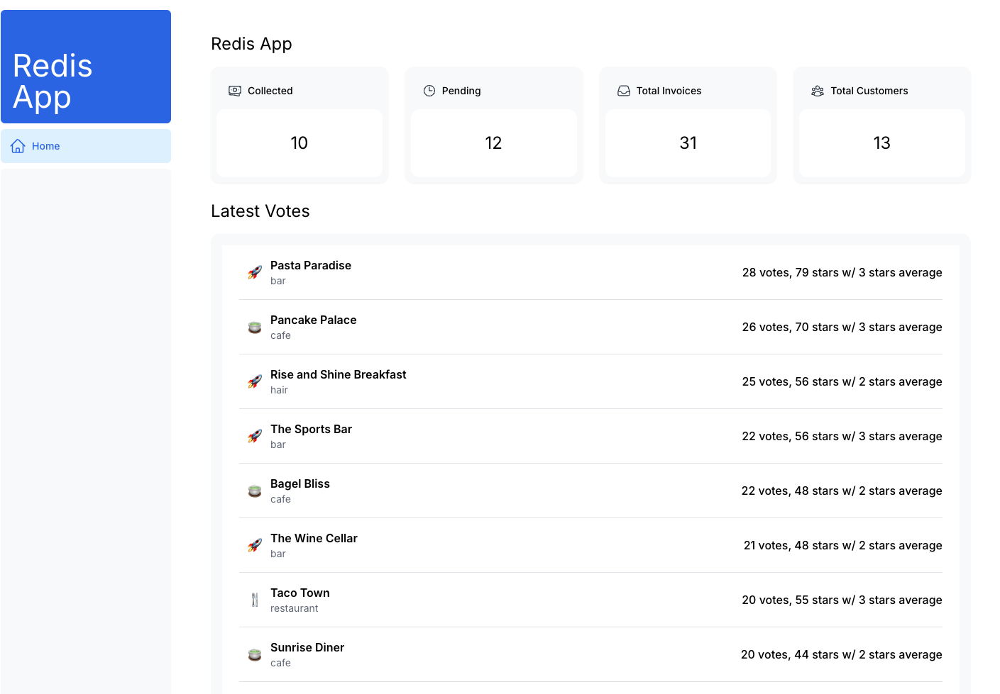

### Installation and Setup

Before you begin, ensure you have Docker installed on your system. If you haven't already, download and install Docker from the official Docker website: <https://www.docker.com/get-docker>



### Start Redis (Docker)

From the node-js-crash-course directory, start Redis using `docker-compose` (note: use `docker-compose` with the "-", **not** "`docker compose`"):

```bash
$ docker-compose up -d or docker compose up --build --wait

Creating network "node-js-crash-course_default" with the default driver
Creating rediscrashcourse ... done

$ docker ps
```

The output from the `docker ps` command should show one container running, using the "redislabs/redismod" image. This container runs Redis 6 with the RediSearch, RedisJSON and RedisBloom modules.

### Load the Sample Data into Redis

Load the course example data using the provided data loader. This is a Node.js application:

```bash
$ npm run initload all
> node src/utils/dataloader.js -- "all"

Loading user data...
User data loaded with 0 errors.
Loading location data...
Location data loaded with 0 errors.
Loading location details...
Location detail data loaded with 0 errors.
Loading checkin stream entries...
Loaded 5000 checkin stream entries.
Creating consumer group...
Consumer group created.
Dropping any existing indexes, creating new indexes...
Created indexes.
Deleting any previous bloom filter, creating new bloom filter...
Created bloom filter.
```

```bash
$ npm run initsql all
> node src/utils/dataloader.js -- "all"
```

## Application Startup

To initiate the application, execute the following commands in separate terminal windows:

- `npm run dev`: Initiates the primary application server.
- `npm run auth`: Activates login functionality.
- `npm run checkinreceiver`: Initiates the stream API for processing checkins.
- `npm run checkinprocessor`: Compiles votes and updates items.
- `npm run checkingenerator`: Tests the service and generates dummy data.

## Accessible Routes

After the application is running, you can access the following routes:

- [Item](http://localhost:8081/api/item/1)
- [Item with Details](http://localhost:8081/api/item/1?withDetails=true)
- [Latest Items](http://localhost:8081/api/items/latest)
- [Latest votes](http://localhost:8081/api/votes/latest)
